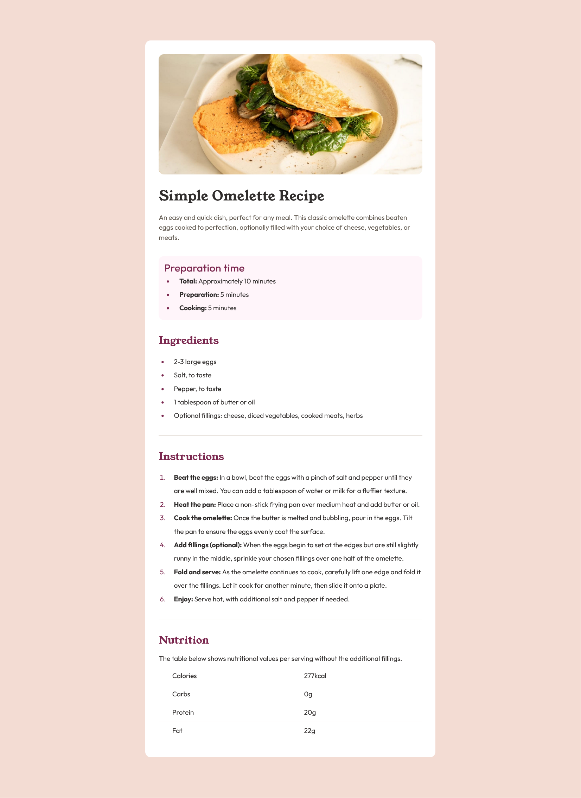

# Frontend Mentor - Social links profile solution

This is a solution to the [Social links profile challenge on Frontend Mentor](https://www.frontendmentor.io/challenges/social-links-profile-UG32l9m6dQ). Frontend Mentor challenges help you improve your coding skills by building realistic projects. 

## Table of contents

- [Overview](#overview)
  - [Screenshot](#screenshot)
  - [Links](#links)
- [My process](#my-process)
  - [Built with](#built-with)
  - [What I learned](#what-i-learned)
- [Author](#author)


## Overview

### Screenshot



### Links

- Solution URL: [https://github.com/bt-ale/recipe-page](https://github.com/bt-ale/recipe-page)
- Live Site URL: [https://bt-ale.github.io/recipe-page/](https://bt-ale.github.io/recipe-page/)

## My process

### Built with

- HTML
- CSS

**Note: These are just examples. Delete this note and replace the list above with your own choices**

### What I learned

This particular challenge was a rewarding one: I had to use lists and tables, which pushed me to explore and apply new, sophisticated methods for styling these core HTML elements.

```css
.ingredients-list li, .instructions-list li {
  list-style-position: outside;
}
```
```css
.ingredients-list li::marker, .instructions-list li::marker {
  color: var(--rose-800);
}
```
```css
.calories-table {
  table-layout: fixed;
  width: 100%;
  border-collapse: collapse;
}
```

## Author

- Github - [bt-ale](https://github.com/bt-ale)
- Frontend Mentor - [@bt-ale](https://www.frontendmentor.io/profile/bt-ale)
